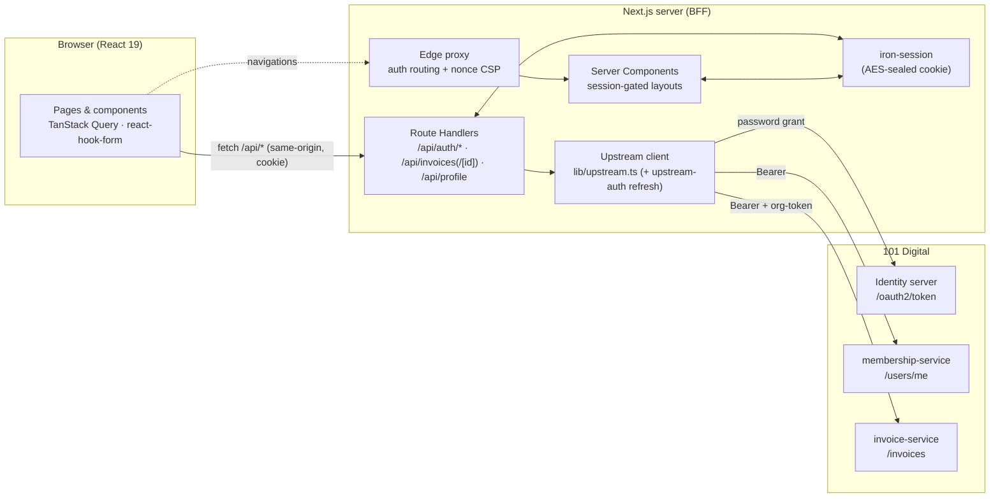
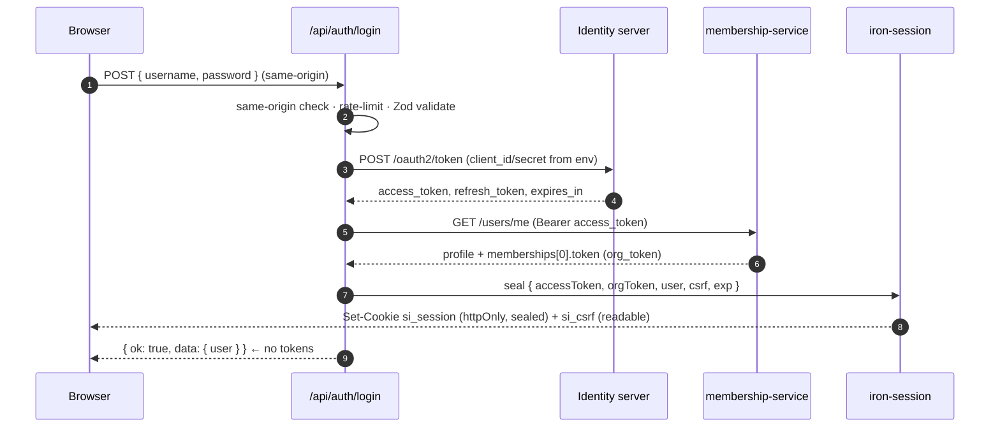
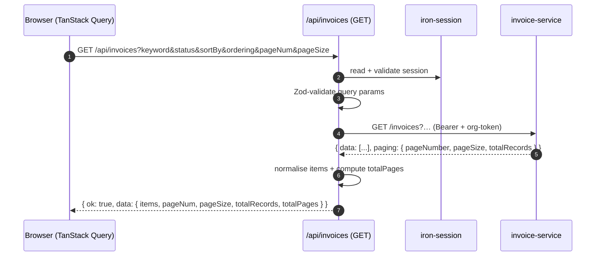
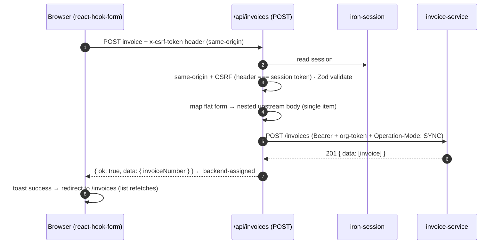

# SimpleInvoice — Architecture

This document describes the architecture of SimpleInvoice, the reasoning behind the key decisions, and how data flows through the system. It complements the [SECURITY.md](SECURITY.md) threat model and the [ADRs](adr/).

---

## 1. Goals & constraints

From the assessment brief:

- **Next.js + TypeScript**, fully responsive, professionally styled.
- Three features: **Login**, **Create Invoice** (single line item), **List/Search/Sort/Filter/Paginate** (as the landing page).
- **Strong security posture** using Next.js server‑side capabilities: server‑side token exchange, secrets off the client, httpOnly token storage, a BFF proxy, server‑side validation, and security headers.
- Reasonable automated testing; clear documentation of design decisions.

The overriding non‑functional driver is therefore **security without sacrificing UX or performance**.

---

## 2. High‑level architecture

SimpleInvoice is a single Next.js application that plays two roles at once: the **React front end** and its own **Backend‑for‑Frontend (BFF)**. The browser never speaks to 101 Digital directly — it only ever calls our `/api/*` routes, which hold the tokens and proxy upstream.



**Why a BFF?** It is the single most important decision (see [ADR‑0001](adr/0001-bff-proxy-pattern.md)). It keeps the `client_id`, `client_secret`, `access_token` and `org_token` entirely server‑side; the browser holds only an opaque, encrypted session cookie. It also gives us one place to enforce validation, CSRF, rate limiting and error normalisation.

---

## 3. Technology choices

| Concern            | Choice                              | Why (short) — full rationale in ADRs |
| ------------------ | ----------------------------------- | ------------------------------------ |
| Framework          | Next.js 16 App Router, React 19     | Server + client runtime in one app enables the BFF; RSC for session‑gated pages. |
| Language           | TypeScript (strict)                 | Type safety end‑to‑end; shared types between server and client. |
| Styling            | Tailwind v4 + shadcn/ui             | Accessible Radix primitives we own the code for; fast, consistent, themeable. [ADR‑0005](adr/0005-shadcn-ui.md) |
| Server data (client)| TanStack Query v5                  | Caching, loading/error states, `keepPreviousData` for smooth pagination. [ADR‑0003](adr/0003-tanstack-query-url-state.md) |
| List state         | URL query string (single source)    | Shareable, bookmarkable, correct back/forward. [ADR‑0003](adr/0003-tanstack-query-url-state.md) |
| Forms & validation | react‑hook‑form + Zod               | One schema validates client and server. [ADR‑0004](adr/0004-zod-shared-validation.md) |
| Session/tokens     | iron‑session (encrypted cookie)     | Stateless, tamper‑proof, no DB. [ADR‑0002](adr/0002-encrypted-cookie-session.md) |
| Unit/integration   | Vitest + Testing Library + MSW      | Fast tests; upstream mocked at the network boundary. |
| End‑to‑end         | Playwright + local mock upstream    | Deterministic, secret‑free browser tests of the real app. [ADR‑0006](adr/0006-e2e-mocked-upstream.md) |

---

## 4. Request flows

### 4.1 Login (server‑side token exchange)



### 4.2 List invoices (proxy with normalisation)



### 4.3 Create invoice (CSRF‑protected mutation)



> The form never sends an `invoiceNumber` — the backend generates and stores it. The BFF reads the assigned number from the create response and returns it so the toast can show it.

### 4.4 Other reads, duplicate, and silent refresh

- **Invoice detail** (`GET /api/invoices/[id]`) and **profile** (`GET /api/profile`) use the same proxy pattern as the list: session‑gated, tokens attached server‑side, and the upstream response normalised (`normalizeInvoiceDetail`, and a token‑free `UserProfile`).
- **Duplicate** reuses the detail endpoint: the create form fetches the source invoice and mounts with its fields mapped in (`invoiceDetailToFormValues`), leaving the number blank so the backend assigns a fresh one.
- **Silent token refresh** — every authenticated upstream call runs through [`withUpstreamAuth`](../../src/lib/upstream-auth.ts): on a `401` it refreshes the access token, rotates the sealed session and retries once (concurrent 401s coalesce into one refresh). This keeps sessions alive on the shared sandbox — full detail in [SECURITY.md §7](SECURITY.md).

---

## 5. Layering & module responsibilities

The code is organised so that **only the `lib/*` server modules know about tokens and upstream URLs**. UI and hooks are upstream‑agnostic and talk to our own API.

```
UI (components, pages)
   │  calls our own /api/* via apiFetch (adds CSRF header, unwraps envelope)
hooks (use-invoices, use-invoice, use-create-invoice, use-profile,
       use-session, use-invoice-query-state)
   │
Route Handlers (/api/*)   ← auth boundary: session validate, CSRF, Zod, rate-limit
   │
lib/upstream-auth.ts      ← withUpstreamAuth: silent refresh + retry on 401
   │
lib/upstream.ts           ← the ONLY module that knows 101 Digital (URLs, headers, tokens)
   │
lib/http.ts               ← fetch with timeout + safe JSON + typed UpstreamError
```

Key modules:

- [`lib/env.ts`](../../src/lib/env.ts) — Zod‑validated, `server-only` env. Fails fast on misconfiguration.
- [`lib/session.ts`](../../src/lib/session.ts) — iron‑session config + `getSession`/`isSessionValid`/`getSessionUser`.
- [`lib/upstream.ts`](../../src/lib/upstream.ts) — token exchange + refresh, profile, invoice list/detail/create; plus `toUpstreamInvoicePayload`, `normalizeInvoice`, `normalizeInvoiceDetail`.
- [`lib/upstream-auth.ts`](../../src/lib/upstream-auth.ts) — `withUpstreamAuth`: on a `401`, refresh the token, rotate the session and retry once.
- [`lib/csrf.ts`](../../src/lib/csrf.ts) / [`lib/rate-limit.ts`](../../src/lib/rate-limit.ts) — mutation defences.
- [`lib/api-response.ts`](../../src/lib/api-response.ts) — the uniform `{ ok, data | error }` envelope.
- [`lib/api-client.ts`](../../src/lib/api-client.ts) — the browser‑safe counterpart that unwraps the envelope and attaches the CSRF header.

---

## 6. Data model (UI‑facing)

The upstream invoice object is large and loosely typed. The BFF normalises each record into a stable, minimal shape so the UI is insulated from upstream quirks:

```ts
interface Invoice {
  id: string;
  invoiceNumber: string;
  reference?: string;
  customerName: string;      // upstream customer.name, or "—"
  currency: string;
  currencySymbol: string;
  invoiceDate: string;
  dueDate: string;
  description: string;
  status: string;            // first active flag from status[] (e.g. "Due")
  totalAmount: number;
  balanceAmount: number;
}
```

Paging is normalised to `{ pageNum, pageSize, totalRecords, totalPages }`.

The **detail** endpoint returns a richer `InvoiceDetail` (customer contact + address, line items with adjustments and custom fields, bank account, documents, and a full totals breakdown), and the **profile** endpoint a token‑free `UserProfile`. Both are normalised the same way, so the UI never touches a raw upstream shape.

---

## 7. Performance considerations

- **`keepPreviousData`** on the list query keeps the current page visible while the next loads — no empty‑state flash during pagination/filtering.
- **Debounced search** (400 ms) avoids a request per keystroke.
- **Server Components** render the authenticated shell and gate on the session without shipping that logic to the client.
- **`cache: "no-store"`** on upstream calls keeps invoice data fresh (it is user‑specific and mutable); TanStack Query provides the client‑side caching layer with a 30 s `staleTime`.
- **No secret material in the client bundle** also means a smaller, cleaner bundle.

---

## 8. Error handling

- Upstream failures are wrapped in a typed `UpstreamError` with a **safe** message (never leaking upstream bodies or tokens) and surfaced through the uniform API envelope.
- The client `apiFetch` throws a typed `ApiClientError`, which components map to inline field errors (422 `fields`) or toast messages.
- The list has explicit **loading / empty / error** states with a retry.

---

## 9. What I would add next (given more time)

Already delivered beyond the brief: invoice **detail view**, **duplicate**, **profile**, full‑payload create form, **silent token refresh**, a **Playwright E2E** suite, and a **GitHub Actions CI** pipeline (lint → typecheck → unit → build → e2e). Remaining ideas:

- **Invoice edit / void** and multi‑line items (behind a feature flag).
- A **shared store (Redis)** for the rate limiter and refresh single‑flight, plus structured request logging and metrics — needed for horizontal scaling.
- **Proactive token refresh** ahead of expiry and a configurable/rolling session length (today it's a ~1‑hour session; refresh already covers mid‑session revocation reactively).
- A **container image** (Dockerfile) for portable deployment.
- **Nonce‑based CSP for styles** to drop `'unsafe-inline'` from `style-src`.
